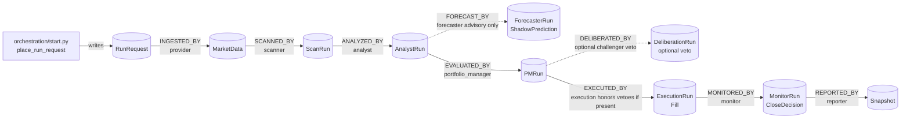
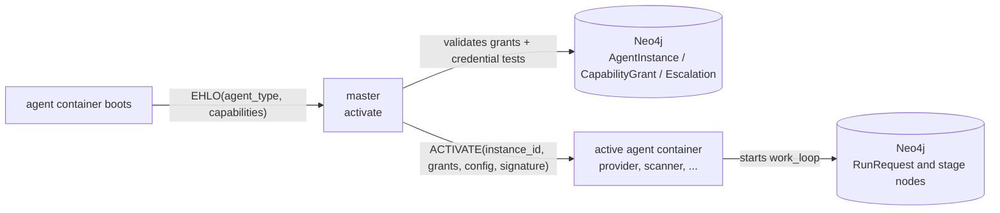
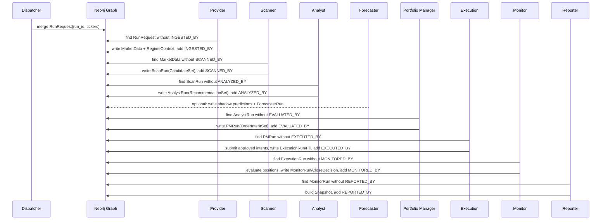
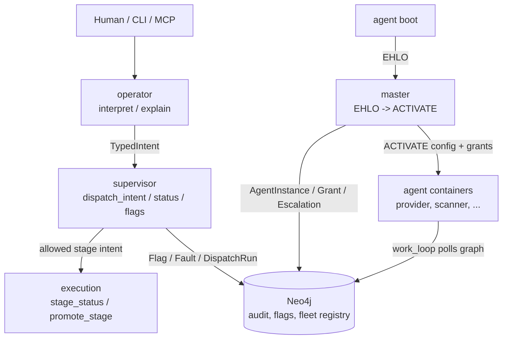

# Agent Message Chain

This is the visual map of how one trading run moves through the system.

The important shift: the main runtime is now **graph-pull**, not direct
agent-to-agent calls. The dispatcher writes one `RunRequest` node. Every agent
then polls Neo4j for upstream work it has not processed yet, writes its own node,
and links it back with a provenance edge.

## Main Run Chain

Read this as a durable graph, not a call stack. The edge means: "this downstream
agent already processed that upstream node."

## Where Master Fits

`master` is **not** in the `RunRequest -> Snapshot` trading chain. It is the
fleet bootstrap gate that runs before any agent starts polling for trading work.

Think of it this way:

- `master` decides **whether a container may become an active agent instance**.
- Once active, that agent joins the normal graph-pull loop and processes
  `RunRequest`, `MarketData`, `ScanRun`, and so on.
- If activation cannot be made safe, `master` records an `Escalation` instead
  of handing out broken config.

## One Run As A Sequence

## What Each Agent Consumes And Emits

| Stage | Wakes up on | Reads | Writes | Edge |
| --- | --- | --- | --- | --- |
| provider | `RunRequest` without child `MarketData` | tickers from `RunRequest`, external data source | `MarketData`, `RegimeContext` | `INGESTED_BY` |
| scanner | `MarketData` without child `ScanRun` | `MarketData` bars, benchmark, earnings | `ScanRun` with `CandidateSet` | `SCANNED_BY` |
| analyst | `ScanRun` without child `AnalystRun` | `CandidateSet`, upstream `MarketData`, `RegimeContext` | `AnalystRun` with `RecommendationSet` | `ANALYZED_BY` |
| forecaster | `AnalystRun` without child `ForecasterRun` | recommendations, provider data via RPC | `ShadowPrediction`, `ForecasterRun` | `FORECAST_BY` |
| portfolio_manager | `AnalystRun` without child `PMRun` | `RecommendationSet`, upstream `MarketData`, `RegimeContext` | `PMRun` with `OrderIntentSet` | `EVALUATED_BY` |
| deliberation | optional `PMRun` without child `DeliberationRun` | PM-approved orders, injected LLM | `DeliberationRun` with vetoed tickers | `DELIBERATED_BY` |
| execution | `PMRun` without child `ExecutionRun` | `OrderIntentSet`, optional vetoes | `ExecutionRun`, `Fill` | `EXECUTED_BY` |
| monitor | `ExecutionRun` without child `MonitorRun` | fills, PM lineage, same-cycle prices | `MonitorRun`, `CloseDecision` | `MONITORED_BY` |
| reporter | `MonitorRun` without child `Snapshot` | full provenance graph for the PM run | `Snapshot` | `REPORTED_BY` |

## Bus Plane

The bus still exists, but it is not the main sequencing mechanism for the fleet
run. It has two jobs:

1. **RPC capabilities:** a caller sends `AgentMessage` to one capability, and the
   bus returns a response or an error. Examples: `provider.get_market_data`,
   `provider.get_regime`, `forecaster.forecast`, `execution.promote_stage`,
   `supervisor.flag_for_human`.
2. **Compatibility pub/sub:** older in-process paper-loop wiring publishes
   claim-check events. Payloads live in graph nodes; the event carries a reference.

```mermaid
flowchart LR
    trigger["run.trigger"]
    scanReady["scan.candidates.ready"]
    analysisReady["analysis.recommendations.ready"]
    ordersReady["portfolio.orders.ready"]
    fillsReady["execution.fills.ready"]
    decisionsReady["monitor.decisions.ready"]
    reportReady["report.snapshot.ready"]

    trigger --> scanReady --> analysisReady --> ordersReady --> fillsReady --> decisionsReady --> reportReady
```

Use this event chain when reading older `agent.py` pub/sub handlers. Use the graph
chain above when reasoning about the current fleet run and `work_loop` entrypoints.

## Control Plane

The control plane governs the system, but it does not make trading decisions.
The trading decisions remain inside the domain agents and are recorded in the
graph chain.

## Source Pointers

- Main trigger: [orchestration/start.py](../orchestration/start.py)
- One-pass graph-pull demonstrator: [orchestration/local_pipeline.py](../orchestration/local_pipeline.py)
- Graph trace reader: [orchestration/batch_trace.py](../orchestration/batch_trace.py)
- Per-agent graph-pull sources: `agents/*/poll.py`
- Bus interface: [kernel/bus.py](../kernel/bus.py)
- Work loop helper: [kernel/work_loop.py](../kernel/work_loop.py)
