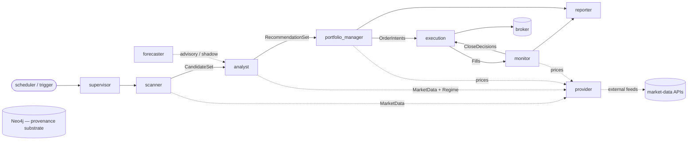
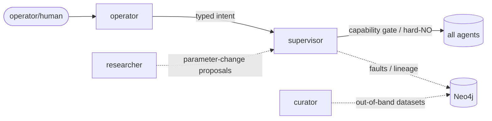

# Agent flow — the choreography

This is the **only** place inter-agent relationships are recorded. Each box is a sealed agent (its
laws live in `agents/<name>/laws/`); each edge is a **typed message**. Use this diagram to eyeball
whether the system is moving in the right direction and to confirm **type/condition alignment across
every hop** (an edge is valid only if the producer's lawful output is a lawful input of the consumer).

> **The diagram may not lie.** Every edge must correspond to a real message-type contract. When the
> message contracts change, this diagram changes in the same commit. (A CI check that the edges match
> the contracts' `consumes`/`emits` is a later hardening step.)

## Daily trading loop (the spine)

## Control & support (off the trading spine)

## Reading notes

- **Solid edges** = the binding trading path (a typed request/response or hand-off).
- **Dashed edges** = supporting flows (data fetch, advisory, audit, out-of-band).
- **`provider` is the single external-data boundary** — every "ask data" edge terminates at it; no
  other agent touches a market-data API.
- **`broker` and the market-data APIs** are external systems; exactly one agent owns each boundary
  (execution → broker, provider → data APIs).
- The **graph** underlies everything: every box appends provenance; no box mutates another's records.

## Legend of the load-bearing message types

| Edge | Message type | Producer role | Consumer role |
| --- | --- | --- | --- |
| scanner → analyst | candidate set | reduced/ranked universe | scores it |
| analyst → PM | recommendation set | scored, gated picks | sizes/risk-checks |
| PM → execution | order intents | sized, approved orders | submits idempotently |
| execution → monitor | fills | executed orders | opens/manages positions |
| monitor → execution | close decisions | exit decisions | submits the close |
| any → provider | market-data / regime request | a data need | clean facts + quality |
